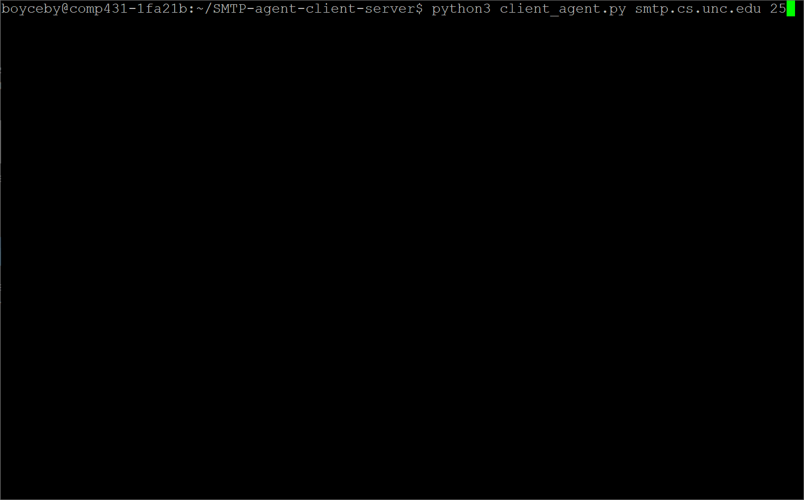

# SMTP-agent-client-server
#### Programs implementing Simple Mail Transfer Protocol (SMTP) mail agent, client, and server functionality using Python.

This pair of programs implements the functionality required to send and receive email to and from different
mail clients/servers on a network using the Simple Mail Transfer Protocol (SMTP). In addition, the pair of
programs also offers mail agent functionality, allowing a command-line user to send an email over a network
to a user-specified host and port number (presumably those of a mail server process), and provides support
for the sending of emails with subjects as well as MIME-encoded attachment files.

The mail agent and client functionalities are implemented by the single **agent_client.py** file, which, when
provided a hostname and port number as arguments and executed, will prompt a user line-by-line via the
command-line to enter data for the email desired to be sent. The user interface for this agent (along with the
response messages that were received by the client in this example) can be seen here:

The mail server functionality is implemented by the **server.py** file, which, when executed and provided a
port number as a command-line argument, will initialize a "welcoming" TCP socket bound to the port number
specified and await a connection from a mail client, at which point it will then create a separate
"connection" TCP socket that it will use to continue its interactions with the mail client. The server
will then receive SMTP messages from the client encompassing email data the client would like delivered
and will store these emails in forward files associated with the domain names of email recipients.

More information having to do with SMTP, internet messaging, and MIME can be found in their respective
Request for Comment (RFC) documentation, including RFCs 821 (SMTP), 822 (internet messaging), and 2045
(MIME).

This project was completed in partial fulfillment of the requirements of COMP 431 with Dr. Kevin Jeffay
at the University of North Carolina at Chapel Hill in fall 2021.
